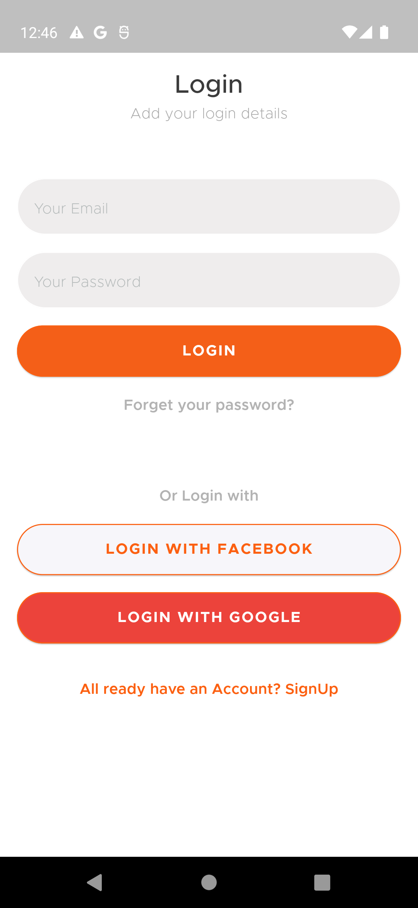
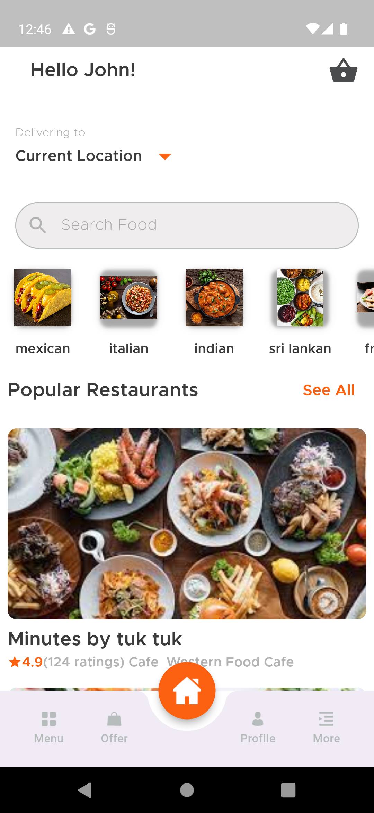
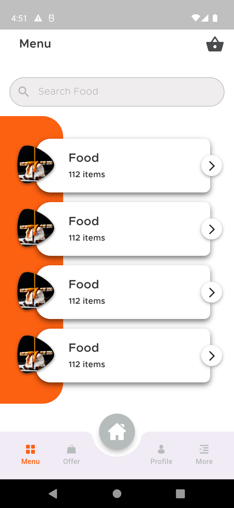
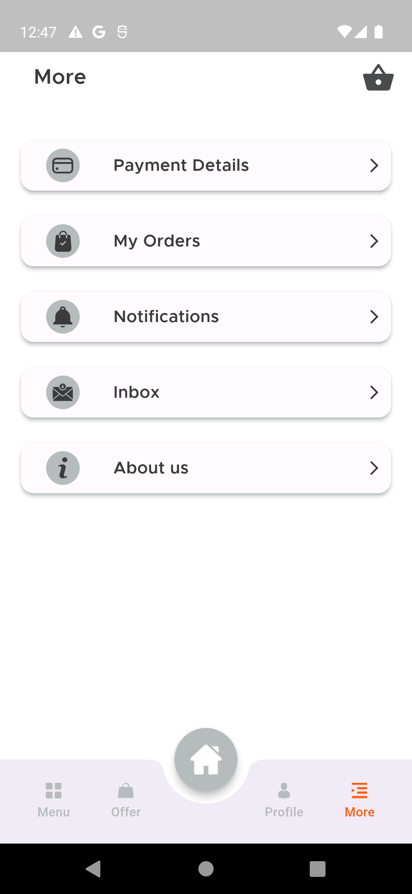
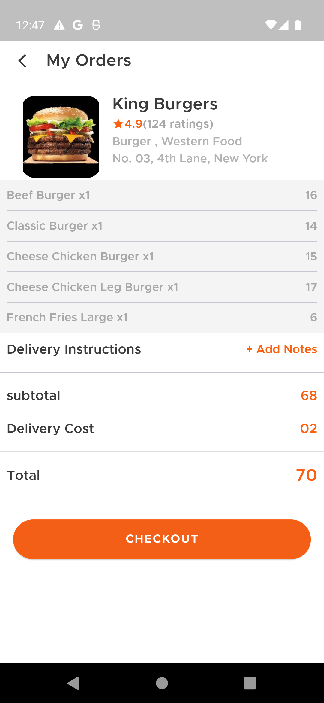
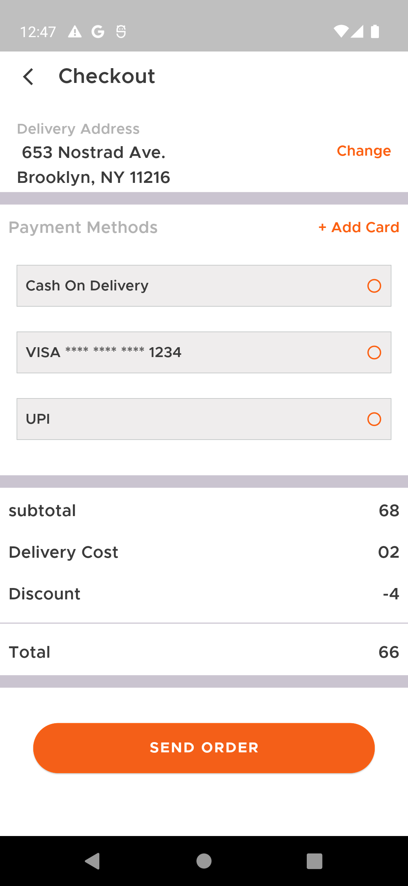
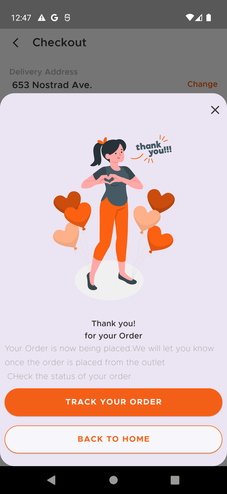
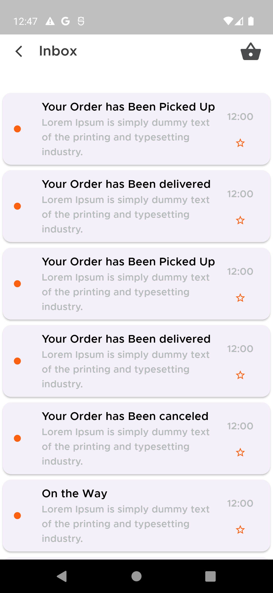
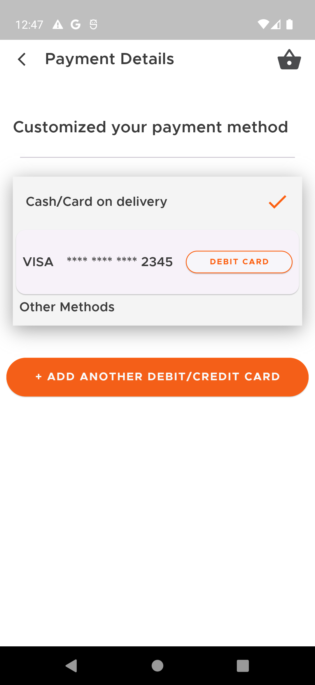
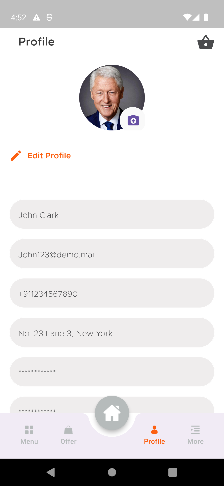

# Meal Sheal
-------------  
### To try the app download the apk from the [Release Tab](https://github.com/mohammedhashim44/Flutter-Grocery-App-UI/releases/download/1.0.0/app-release.apk)  
-------------
  
#### Flutter Version Used : 3.17.0
#### Design Credit : Akila Weerakoon  
#### Design Files on Adobe XD : [Meal Monkey Food Delivery App UI]([https://www.figma.com/community/file/88264500795633726](https://www.behance.net/gallery/108639283/Meal-Monkey-Food-delivery-iOS-mobile-application?ref=uistore.design))  
 
-------------  

## Directory Tree
```
├───📁 components/
│   ├───📄 appbar.dart
│   ├───📄 button.dart
│   ├───📄 custom_appbar.dart
│   ├───📄 custom_search_bar.dart
│   ├───📄 dropdown_field.dart
│   ├───📄 icon_link.dart
│   ├───📄 input_field.dart
│   ├───📄 links.dart
│   ├───📄 loading_indicator.dart
│   ├───📄 page_scaffold.dart
│   ├───📄 page_scaffold_with_gradient.dart
│   ├───📄 phone_input_field.dart
│   ├───📄 popular_text_link.dart
│   ├───📄 section_wrapper.dart
│   ├───📄 tab_button.dart
│   └───📄 text_link.dart
├───📁 core/
│   ├───📁 models/
│   │   ├───📄 categories_data_model.dart
│   │   ├───📄 content_model.dart
│   │   ├───📄 parent.dart
│   │   ├───📄 products_data_model.dart
│   │   └───📄 user_model.dart
│   ├───📁 services/
│   │   └───📄 api_service.dart
│   ├───📄 constants.dart
│   ├───📄 database_helper.dart
│   ├───📄 design_system.dart
│   ├───📄 locator.dart
│   ├───📄 provider_setup.dart
│   ├───📄 router.dart
│   └───📄 share_data_layer.dart
├───📁 views/
│   ├───📁 change_password/
│   │   ├───📄 view.dart
│   │   └───📄 view_model.dart
│   ├───📁 home/
│   │   ├───📁 views/
│   │   │   ├───📁 home_tab/
│   │   │   │   ├───📄 view.dart
│   │   │   │   └───📄 view_model.dart
│   │   │   ├───📁 menu_tab/
│   │   │   │   ├───📄 view.dart
│   │   │   │   └───📄 view_model.dart
│   │   │   ├───📁 more_tab/
│   │   │   │   ├───📁 views/
│   │   │   │   │   └───...
│   │   │   │   ├───📄 view.dart
│   │   │   │   └───📄 view_model.dart
│   │   │   ├───📁 offers_tab/
│   │   │   │   ├───📄 view.dart
│   │   │   │   └───📄 view_model.dart
│   │   │   └───📁 profile_tab/
│   │   │       ├───📄 view.dart
│   │   │       └───📄 view_model.dart
│   │   ├───📄 view.dart
│   │   └───📄 view_model.dart
│   ├───📁 login/
│   │   ├───📄 view.dart
│   │   └───📄 view_model.dart
│   ├───📁 onboarding/
│   │   ├───📄 view.dart
│   │   └───📄 view_model.dart
│   ├───📁 otp/
│   │   ├───📄 view.dart
│   │   └───📄 view_model.dart
│   ├───📁 reset_password/
│   │   ├───📄 view.dart
│   │   └───📄 view_model.dart
│   ├───📁 signup/
│   │   ├───📄 view.dart
│   │   └───📄 view_model.dart
│   └───📁 splash/
│       ├───📄 view.dart
│       └───📄 view_model.dart
└───📄 main.dart
 
```
## ScreenShots  
<p float="left">
  
   
  
  
   
  
  
   
  
  
  
  
  
</p>

-------------  

## Screens  
- Login Screen  
- Signup Screen  
- Home Screen  
- Menus Scrren  
- Profile Screen  
- More Screen
- Notification Screen  
- Payment details  
- Checkout Bottom Sheet    
- Order Accepted Screen  
